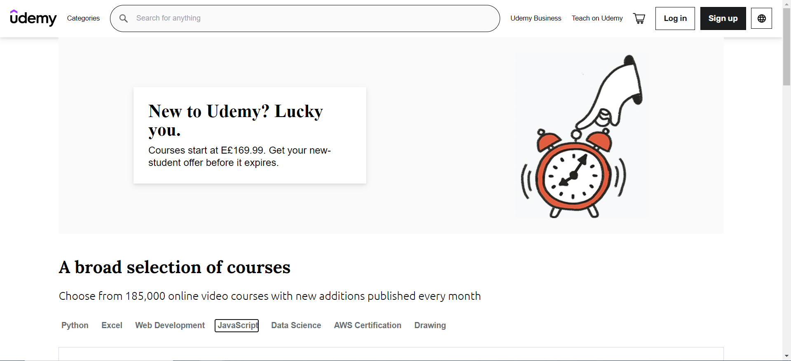
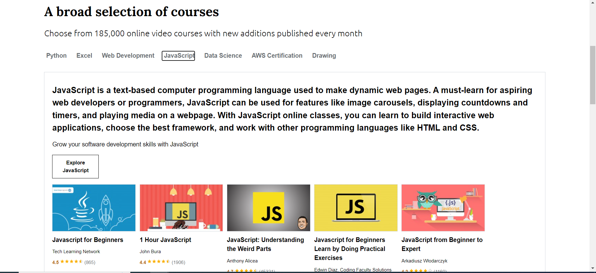
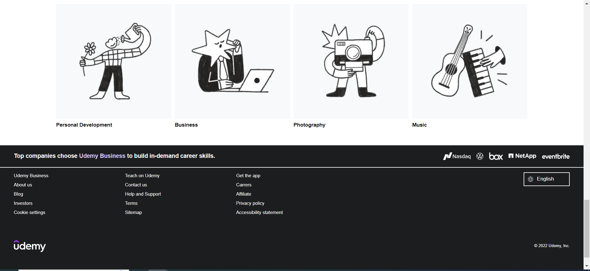
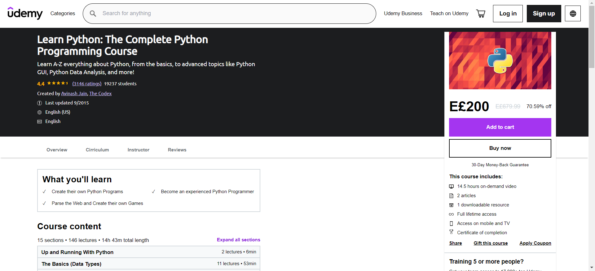
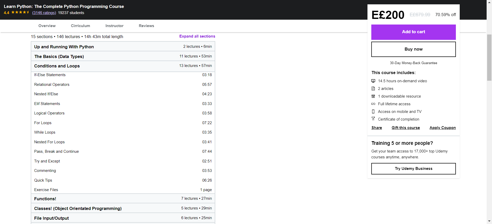
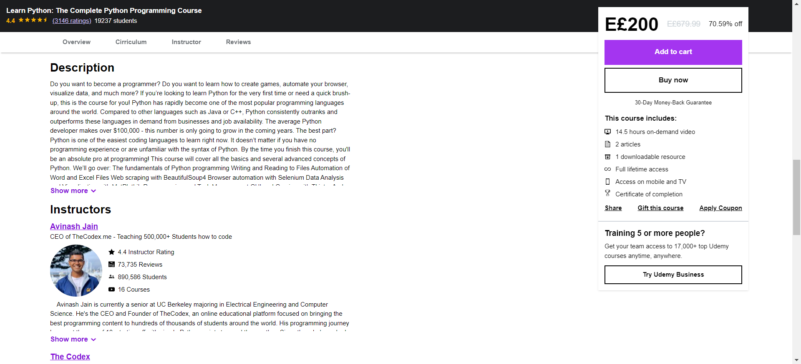
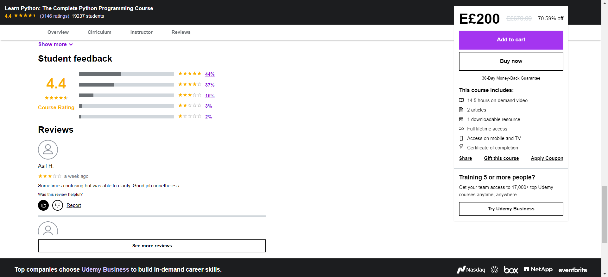

# Udemy Home Page - bld.ai

## Overview

This project is a responsive clone of the Udemy home page, created using React.js. The styling is handled through a combination of CSS Modules and Tailwind CSS. The project includes two main pages: the home page and the course page, offering a user experience similar to that of the original Udemy website.

## Screenshots

<p>
  
  <br>
  <em>Home Page - Shows the main landing page of the Udemy clone website with featured courses.</em>
</p>

<p>
  
  <br>
  <em>Home Courses Section - Displays a list of available courses with their prices and ratings.</em>
</p>

<p>
  
  <br>
  <em>Categories and Footer - Showcases the different course categories and the website footer.</em>
</p>

<p>
  
  <br>
  <em>Course Page - Provides detailed information about a specific course.</em>
</p>

<p>
  
  <br>
  <em>Course Content Page - Lists the content and sections within a course.</em>
</p>

<p>
  
  <br>
  <em>Course Instructor Section - Displays details about the course instructor.</em>
</p>

<p>
  
  <br>
  <em>Course Review Section - Shows student feedback and ratings for the course.</em>
</p>

## Features

- **Browse Courses:** View all available courses along with their prices.
- **Course Details:** Click on any course to see detailed information.
- **Instructor Information:** View detailed profiles of course instructors.
- **Student Feedback:** See all student feedback and ratings for a course.
- **Interactive Comments:** Like or dislike any student comment on a course.

## Technologies Used

- **React.js** for building the user interface.
- **CSS Modules** and **Tailwind CSS** for styling.
- **JSON Server** for serving course data.

## Installation

Follow these steps to set up the project locally:

1. **Clone the repository:**

   ```bash
   git clone https://github.com/yourusername/udemy-homepage-clone.git
   cd udemy-homepage-clone
   ```

2. **Install Dependencies:**
   While in the project directory, install the required dependencies:

   ```bash
   npm install
   ```

3. **Start the JSON Server:**
   Navigate to the `Server` directory and start the JSON server:

   ```bash
   cd Server
   npx json-server --watch data.json
   ```

4. **Run the Project:**
   Return to the project root directory and start the web page:

   ```bash
   cd ..
   npm run start
   ```

## Usage

Once the project is running, the website will be accessible in your browser at `http://localhost:3010`. Explore the available courses, view details, and interact with the content.
